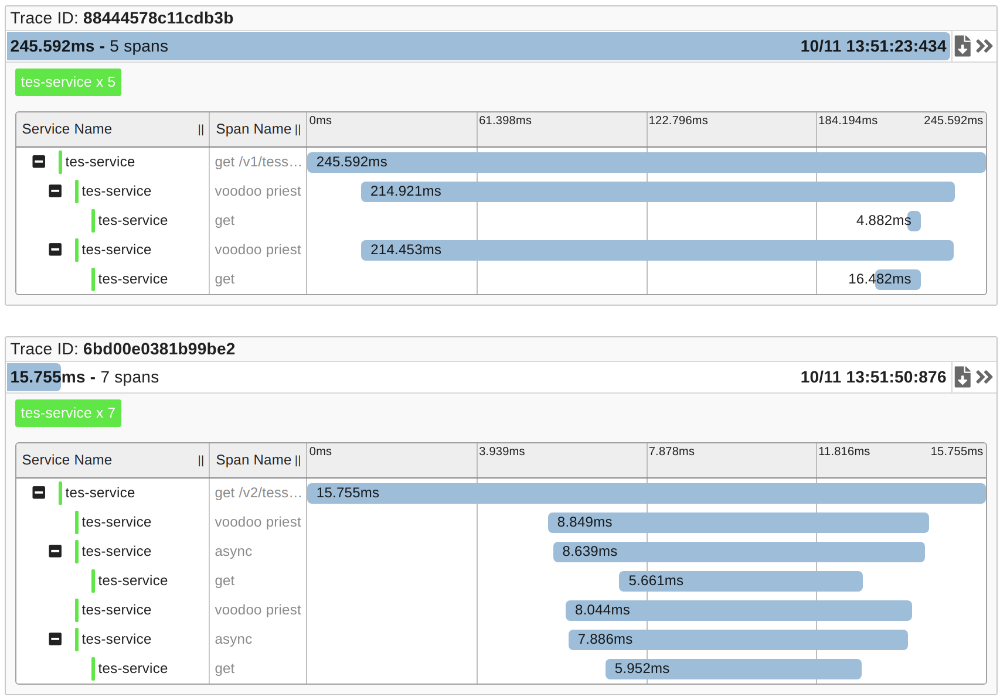

# Getting Started
## Running
```
./gradlew envUp
./gradlew bootRun

# now call 'http://localhost:8080/v1/tess/bf73ce21-f91b-4619-8891-1b4b471db3fd'
# now call 'http://localhost:8080/v2/tess/bf73ce21-f91b-4619-8891-1b4b471db3fd'
# now look 'http://localhost:9411/zipkin'
# now stop <crtl>+c

./gradlew envDown
```
## Analysing

